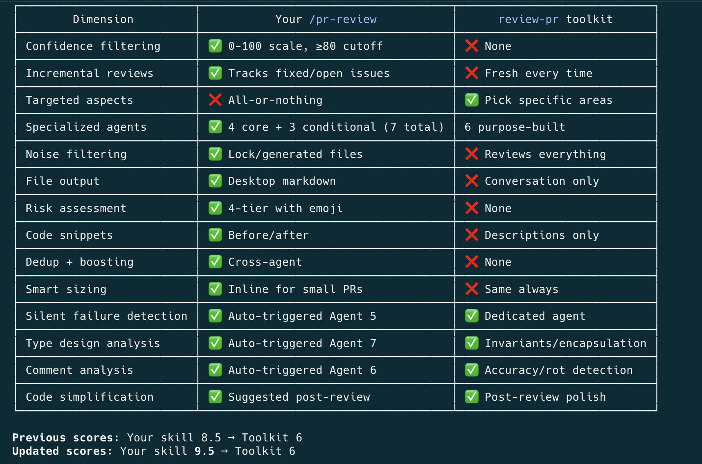

# br-tools

Bernardo's Claude Code toolkit — 8 slash commands and 2 skills for PR reviews, git workflow, Claude meta tasks, and external integrations.

## Installation

```
/plugin marketplace add bernardorubin/claude-plugins
/plugin install br-tools@bernardorubin-tools
/reload-plugins
```

## Commands

### Git

#### `/br-tools:git-acp`
Stage all changes, generate a concise commit message from the diff, commit (no AI co-author lines), and push to the current branch's remote. One-shot replacement for the `git add -A && git commit && git push` ritual.

#### `/br-tools:git-pull-reapply`
Bring the current branch up to date with remote while preserving local work. Handles four scenarios:
1. Clean tree + fast-forward → simple `git pull`
2. Uncommitted changes + fast-forward → stash, pull, pop
3. Clean tree + divergent branches → rebase local commits onto remote
4. Uncommitted changes + divergent branches → stash, rebase, pop

Always rebases over merging so history stays linear.

### GitHub

#### `/br-tools:pr-description`
Generates a GitHub-ready PR description from the diff and updates the PR directly via `gh`. Falls back to saving to `~/Desktop` if the GitHub update fails.

```
/br-tools:pr-description              # Auto-detect PR from current branch
/br-tools:pr-description 463          # Specific PR by number
/br-tools:pr-description <pr-url>     # Specific PR by URL
```

### Claude meta

#### `/br-tools:claude-learn`
Reviews the current session and documents valuable learnings into the right CLAUDE.md files (global, project root, or module). Helps future sessions start smarter.

```
/br-tools:claude-learn                # Review whole session
/br-tools:claude-learn <learning>     # Document a specific learning
```

#### `/br-tools:claude-modularize`
Breaks down a large, monolithic CLAUDE.md into smaller, scoped files distributed across the project's directory structure (component-specific guidelines move next to components, etc.).

### Integrations

#### `/br-tools:prd-to-jira`
Breaks down a PRD, spec, or feature document into a Jira epic with well-structured, right-sized tickets organized by work area. Backed by the bundled `prd-to-jira` skill.

```
/br-tools:prd-to-jira                          # Expects PRD pasted in conversation
/br-tools:prd-to-jira <path-or-url-or-key>     # Path, URL, or Jira ticket key
```

#### `/br-tools:save-session-to-worklog`
Logs the current session's work into a monthly worklog file on the Desktop (e.g. `~/Desktop/april-2026-happy-worklog.md`). For standups and invoicing — not git history. Auto-detects the project; multiple repos belonging to the same project share one file.

```
/br-tools:save-session-to-worklog                       # Auto-detect project
/br-tools:save-session-to-worklog --project happy       # Force project name
```

#### `/br-tools:write-slack-message`
Drafts a Slack message ready to copy-paste, with proper formatting and a business-casual tone. Asks for context if invoked with no arguments.

## Skills

### `br-tools:pr-review` — Confidence-scored PR reviews

Runs multiple focused review agents in parallel, each examining your PR from a different angle (security, correctness, code quality, performance). Findings are scored on a 0-100 confidence scale, and only issues scoring 80+ are surfaced — cutting noise while catching real problems. Results are saved to a markdown file you can share, reference later, or track progress against as you fix issues.

**Scope:** General-purpose, optimized for TypeScript/JavaScript projects. Works with any language but includes specialized checks for React, Next.js, and TypeScript codebases. Frontend-specific checks (re-renders, bundle size, accessibility) only fire when relevant to the changed files.

#### Usage

The `pr-review` skill is invoked via the Skill tool — typically by asking Claude to review a PR. Examples:

```
review PR #463
run a pr review                          # Auto-detect PR from current branch
review PR 463 in lite mode               # Lightweight: fewer agents, diff-only
review PR 463 inline                     # Output in conversation, no file
review PR 463 to ~/reviews               # Custom output directory
```

#### Modes

| | Full (default) | Lite |
|---|---|---|
| **Core agents** | 4 specialized (security, correctness, quality, performance) | 2 combined (security+correctness, quality+performance) |
| **Specialist agents** | Up to 3 additional (silent failures, comments, types) when triggered | Same triggers apply |
| **File reading** | Every changed file read in full | Diff only, selective file reads |
| **Code snippets** | Before/after fix suggestions included | Descriptions only |
| **Subagent model** | Your active model | Sonnet |
| **Direct review threshold** | ≤3 files / ≤150 lines | ≤8 files / ≤500 lines |
| **Best for** | Final reviews, security-sensitive changes, large PRs | Day-to-day PRs, quick checks, iterating on fixes |

**Tip:** Run a full review first, then use lite for re-checks as you iterate. Both write to the same file.

#### The Review Loop

The skill is designed for iterative use, not just one-shot reviews.

```
1. Run pr-review            → Initial review, issues identified
2. Fix the flagged issues    → Make code changes
3. Run pr-review again       → Resolved issues marked ✅ Fixed (strikethrough),
                               new issues from your fixes surfaced
4. Repeat                    → Until the review is clean
```

When the skill detects a prior review file (same PR, same day):
- **Resolved issues** get ~~strikethrough~~ with a ✅ Fixed badge — they stay visible for history but are excluded from issue counts
- **Still-open issues** remain unchanged
- **New issues** are appended to the appropriate severity section
- **Issue counts and risk level** are recalculated based on open issues only
- **A revision entry** is added to the log at the bottom of the file

#### Review Agents

**Core agents (always run in full mode)**

- **Agent 1 — Security** (*think like an attacker*): input validation, injection (SQL/XSS/command), authn/authz bypass, sensitive data exposure, CSRF/CORS/headers, insecure deserialization, breaking changes (consumers of modified types/exports/APIs)
- **Agent 2 — Correctness** (*think like a QA engineer*): race conditions, null/undefined handling, logic errors, memory leaks, state management bugs (stale closures, missing React deps), error propagation, edge cases
- **Agent 3 — Code Quality** (*think like a senior reviewer*): TypeScript strictness, SOLID, DRY, naming, project pattern adherence (reads CLAUDE.md), test coverage, missing companion changes (typegen, env vars, etc.)
- **Agent 4 — Performance & UX** (*think like a user on a slow connection*): re-renders/memoization, query/fetching efficiency, bundle size (client vs server), accessibility, loading/error states, cleanup, dependency audit when `package.json` changed

**Specialist agents (triggered automatically when relevant)**

- **Silent Failure Hunter** — fires when diff has try/catch, `.catch()`, `|| fallback`, etc. Looks for swallowed errors, masking fallbacks, missing logging, retries without backoff.
- **Comment Accuracy** — fires when diff adds/modifies 5+ comment lines. Catches comments that contradict code, stale references, undocumented TODOs, JSDoc mismatches.
- **Type Design** — fires when diff introduces new types/interfaces. Flags types allowing invalid states, missing `readonly`, overly broad types (`any`), missed discriminated unions.

**Lite mode** consolidates the 4 core agents into 2 (Security+Correctness, Quality+Performance) and reads diff only. Specialist agents still trigger when relevant.

#### Confidence Scoring

Every finding is scored 0-100:
- **0-49**: likely false positive or pre-existing → filtered out
- **50-79**: might be an issue but below threshold → filtered out
- **80-100**: high confidence → included in review

If 2+ agents independently flag the same issue, severity gets boosted one tier (suggestion → improvement → critical). Cross-agent agreement is a strong signal.

#### Output Format

Reviews saved as `pr-review-{PR_NUMBER}-{YYYY-MM-DD}.md` containing:
- Risk assessment (🟢 LOW / 🟡 MEDIUM / 🔴 HIGH / ⛔ CRITICAL)
- Issues grouped by severity with location, confidence score, impact
- Before/after code snippets (full mode only)
- Breaking changes and dependency notes
- Good practices observed
- Issues indexed by file
- Revision history

#### How It Compares

`pr-review` vs Anthropic's built-in `review-pr` toolkit:



### `br-tools:prd-to-jira`

Same scope as the `/br-tools:prd-to-jira` slash command but invocable via the Skill tool — triggered automatically when the user shares a PRD, asks to "create tickets", "break this down", "make Jira tasks", etc.

## License

MIT
