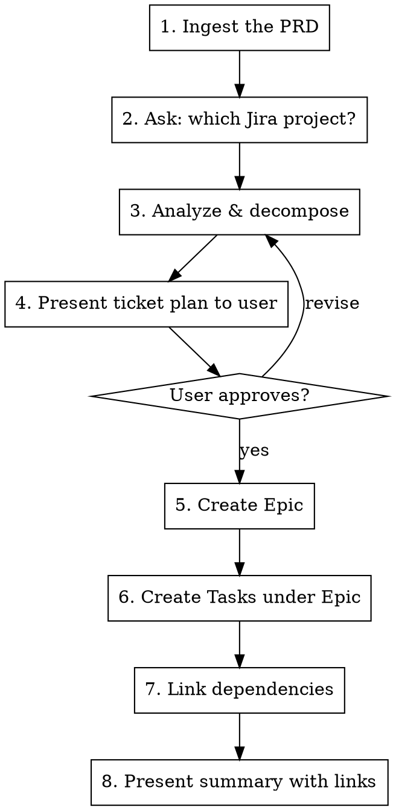

# PRD to Jira Tickets

Break down a Product Requirements Document into a Jira epic with well-structured, right-sized tickets organized by work area.

## Workflow



## Step 1: Ingest the PRD

The PRD can come from multiple sources. Identify which one and read it fully before proceeding.

| Source | How to read |
|--------|-------------|
| Pasted text | Already in conversation — use directly |
| Local file (`.md`, `.pdf`, `.txt`) | Read tool |
| Google Doc URL | Open with Chrome MCP (`mcp__claude-in-chrome__navigate`, then `mcp__claude-in-chrome__get_page_text`) |
| Jira ticket | `jira-curl <project> GET "/rest/api/3/issue/<KEY>?fields=description,summary"` |
| Confluence / other URL | Chrome MCP to read page content |

If the PRD is long, read it completely before starting analysis. Missing context leads to bad tickets.

## Step 2: Ask Which Jira Project

Always ask the user which project to use before creating anything. Available projects depend on the user's `jira-curl` config (check `~/.config/jira/credentials` for project aliases).

## Step 3: Analyze & Decompose

Read the PRD and break it down by asking yourself:

### Identify work areas
Tag each piece of work with an area. Common ones:
- `[Frontend]` — UI, components, pages, client-side logic
- `[Backend]` — API endpoints, business logic, database
- `[Ops]` — Infrastructure, deployment, CI/CD, monitoring
- `[Marketing]` — Landing pages, copy, campaigns
- `[Design]` — Mockups, design system changes
- `[QA]` — Test plans, automation, manual test scripts
- `[Data]` — Analytics, reporting, data pipelines

Use whatever areas make sense for the PRD. The point is that tickets map to the person or team who will do the work.

### Right-size the tickets
Each ticket should be a **deliverable, QA-able unit of work**. Think of it as: "someone could pick this up, do it, and someone else could verify it's done."

**Too small:** "Add a CSS class to the button" — this isn't independently deliverable. Group it with the feature that needs the button.

**Too big:** "Build the entire insurance verification flow" — this has multiple independently testable pieces (form UI, API integration, eligibility logic, error states). Break it up.

**Right-sized:** "Build the insurance form with state/payor/member ID fields and validation" — one person can do it, another can QA it, and it has clear completion criteria.

When in doubt, ask: "Could someone write meaningful acceptance criteria and QA steps for this?" If yes, it's a ticket. If the ACs would be trivial ("it exists") or sprawling ("the whole feature works"), resize.

### Flag dependencies
As you decompose, note which tickets block others. Common patterns:
- Backend API must exist before frontend can integrate
- Database schema changes before backend logic
- Design must be finalized before frontend build
- Ops/infra setup before deployment

### Identify open questions
If the PRD has gaps, ambiguities, or decisions that need input, collect them. These become the optional Questions section on relevant tickets — only add questions to tickets where the gap actually affects that ticket's work.

## Step 4: Present the Plan

Before creating anything in Jira, present the full breakdown to the user in a clear format:

```
## Epic: [Epic title]

### Tickets:

1. **[Frontend] Build insurance form UI**
   - ACs: form fields for state, payor, member ID; validation; error states
   - Dependencies: none
   - Questions: Should we support auto-complete for payor names?

2. **[Backend] Create eligibility check endpoint**
   - ACs: POST /api/eligibility accepts member info, returns coverage status
   - Dependencies: none

3. **[Frontend] Integrate eligibility check with form**
   - ACs: form submits to API, handles success/failure/loading states
   - Dependencies: blocked by #2
   - Questions: What should the loading state look like?

4. **[Ops] Set up monitoring for eligibility API**
   - ACs: alerts for error rate > 5%, latency dashboard
   - Dependencies: blocked by #2
```

Wait for the user to review and approve before creating tickets. They may want to merge, split, reword, or reprioritize.

## Step 5-7: Create Tickets in Jira

Once approved, create everything using `jira-curl`. The wrapper lives at `~/.local/bin/jira-curl`.

### Create the Epic

```bash
~/.local/bin/jira-curl <project> POST "/rest/api/3/issue" -d '{
  "fields": {
    "project": {"key": "<PROJECT_KEY>"},
    "summary": "<Epic title>",
    "issuetype": {"id": "10000"},
    "description": <ADF description>
  }
}'
```

### Create Tasks under the Epic

Use issue type Task (id: `10002`). Link to epic via `customfield_10014`.

```bash
~/.local/bin/jira-curl <project> POST "/rest/api/3/issue" -d '{
  "fields": {
    "project": {"key": "<PROJECT_KEY>"},
    "summary": "[Area] Task title",
    "issuetype": {"id": "10002"},
    "customfield_10014": "<EPIC_KEY>",
    "description": <ADF description>
  }
}'
```

### Ticket Description Format (ADF)

Jira uses Atlassian Document Format. Structure each ticket description as:

```json
{
  "version": 1,
  "type": "doc",
  "content": [
    {
      "type": "heading", "attrs": {"level": 2},
      "content": [{"type": "text", "text": "Description"}]
    },
    {
      "type": "paragraph",
      "content": [{"type": "text", "text": "What this ticket is about and why it matters. Include enough context that someone unfamiliar with the PRD can understand the work."}]
    },
    {
      "type": "heading", "attrs": {"level": 2},
      "content": [{"type": "text", "text": "Acceptance Criteria"}]
    },
    {
      "type": "bulletList",
      "content": [
        {
          "type": "listItem",
          "content": [{"type": "paragraph", "content": [{"type": "text", "text": "Specific, testable criterion"}]}]
        }
      ]
    },
    {
      "type": "heading", "attrs": {"level": 2},
      "content": [{"type": "text", "text": "QA Instructions"}]
    },
    {
      "type": "orderedList",
      "content": [
        {
          "type": "listItem",
          "content": [{"type": "paragraph", "content": [{"type": "text", "text": "Step-by-step instruction for verifying this ticket"}]}]
        }
      ]
    }
  ]
}
```

**Optional Questions section** — only include when the PRD has genuine gaps affecting this ticket:

```json
{
  "type": "heading", "attrs": {"level": 2},
  "content": [{"type": "text", "text": "Open Questions"}]
},
{
  "type": "bulletList",
  "content": [
    {
      "type": "listItem",
      "content": [{"type": "paragraph", "content": [{"type": "text", "text": "Specific question that needs answering before or during this work"}]}]
    }
  ]
}
```

### Writing Good Ticket Content

**Description:** Give enough context that someone who hasn't read the PRD can understand what to do and why. Reference the broader feature but focus on this ticket's scope.

**Acceptance Criteria:** Specific and testable. Each AC should be verifiable with a yes/no answer.
- Good: "Form validates that member ID is 9-12 alphanumeric characters"
- Bad: "Form works correctly"

**QA Instructions:** Step-by-step instructions for verifying the ticket is done. Include:
- Prerequisites (test accounts, environment setup)
- Exact steps to reproduce/test
- Expected results at each step
- Edge cases to check

**Questions:** Only when there are genuine gaps. Don't manufacture questions — if the PRD is clear on a ticket's scope, skip this section entirely.

### Link Dependencies

After all tickets are created, link dependent tickets using "Blocks" (link type id: `10000`):

```bash
~/.local/bin/jira-curl <project> POST "/rest/api/3/issueLink" -d '{
  "type": {"id": "10000"},
  "outwardIssue": {"key": "<BLOCKER_KEY>"},
  "inwardIssue": {"key": "<BLOCKED_KEY>"}
}'
```

This creates "BLOCKER_KEY blocks BLOCKED_KEY" / "BLOCKED_KEY is blocked by BLOCKER_KEY".

## Step 8: Present Summary

After creating everything, present a clean summary:

```
## Created: [Epic Title] (HPY-XXX)

| # | Ticket | Area | Blocked By |
|---|--------|------|------------|
| 1 | HPY-101 [Frontend] Build insurance form | Frontend | — |
| 2 | HPY-102 [Backend] Eligibility endpoint | Backend | — |
| 3 | HPY-103 [Frontend] Integrate eligibility | Frontend | HPY-102 |
| 4 | HPY-104 [Ops] Monitoring setup | Ops | HPY-102 |

Tickets with open questions: HPY-101, HPY-103
```

## Common Mistakes

- **Creating tickets before user approval** — Always present the plan first. Deleting/editing Jira tickets after creation is annoying.
- **Tickets too granular** — "Add field X to form" is not a ticket. The form with all its fields is a ticket.
- **Missing context in descriptions** — Don't assume the reader has the PRD. Each ticket should stand on its own.
- **Vague ACs** — "It works" is not an AC. Be specific about what "works" means.
- **Questions everywhere** — Only add questions when there are genuine PRD gaps for that specific ticket. Most tickets shouldn't need a questions section.
- **Forgetting to link dependencies** — This is the whole point of flagging them. Create the links in Jira, don't just mention them in descriptions.
